# Codebase Analysis using an LLM

A production-oriented Python solution for the coding assignment: analyze a repository, extract code knowledge, enrich it with an LLM, and write a strict machine-readable JSON report.

The default target is [`codejsha/spring-rest-sakila`](https://github.com/codejsha/spring-rest-sakila), a Spring Boot REST API for the MySQL Sakila sample database.

## What this solution demonstrates

- **Efficient repository ingestion:** shallow Git clone or direct local-path analysis.
- **Deterministic static analysis:** Java classes, methods, signatures, annotations, endpoints, imports, line metrics, and cyclomatic complexity are extracted locally.
- **Token-safe LLM integration:** file content is measured and divided into overlapping chunks before it is sent to the model.
- **Structured output:** LangChain's structured-output interface and Pydantic schemas validate every LLM response and the final report.
- **Map/reduce analysis:** file-level results are produced first, then reduced into a repository-level architecture summary.
- **Reliability:** retries, per-chunk caching, partial-failure handling, atomic JSON writes, and a schema validation command.
- **Testability:** an offline deterministic mode makes CI and demonstrations possible without spending API tokens.

## Architecture

```mermaid
flowchart LR
    A[Git URL or local path] --> B[Repository workspace]
    B --> C[Filtered file scanner]
    C --> D[Deterministic parsers]
    D --> E[Classes, methods, signatures, metrics]
    E --> F[Token-aware chunker]
    F --> G[LangChain structured LLM calls]
    G --> H[Pydantic validation and cache]
    H --> I[Repository reducer]
    I --> J[Validated analysis.json]
```



### Why static analysis and LLM analysis are separated

An LLM is useful for semantic descriptions and architectural synthesis, but it should not be trusted to count methods or estimate complexity from memory. This implementation computes factual metadata locally and supplies those facts to the model. The final output records whether each file was successfully LLM-enriched.

## Output contents

The JSON report contains:

- project purpose, functionality, languages, and frameworks;
- architecture summary, layers, patterns, and data flow;
- file-level purpose and dependencies;
- classes and their descriptions;
- key methods, exact signatures, parameters, annotations, and endpoint metadata;
- line counts and cyclomatic complexity;
- complexity hotspots, risks, noteworthy aspects, assumptions, and limitations;
- execution metadata, source commit, skipped files, cache hits, and warnings.

## Quick start

### 1. Prerequisites

- Python 3.11 or newer
- Git
- An OpenAI-compatible API key for LLM mode

### 2. Install

```bash
python -m venv .venv
```

Windows PowerShell:

```powershell
.\.venv\Scripts\Activate.ps1
python -m pip install -e ".[dev]"
Copy-Item .env.example .env
```

macOS/Linux:

```bash
source .venv/bin/activate
python -m pip install -e '.[dev]'
cp .env.example .env
```

Set `OPENAI_API_KEY` in `.env`. Never commit `.env`.

### 3. Run the assignment target

Run this command before submission so `output/analysis.json` represents the complete target repository and records `execution.mode` as `llm`.

```bash
codebase-analyzer analyze \
  --repo https://github.com/codejsha/spring-rest-sakila.git \
  --output output/analysis.json
```

Windows PowerShell:

```powershell
codebase-analyzer analyze `
  --repo "https://github.com/codejsha/spring-rest-sakila.git" `
  --output "output/analysis.json" `
  --llm-max-files 40
```

### 4. Validate the deliverable

```bash
codebase-analyzer validate-output output/analysis.json
pytest
```


## Runtime and progress

The CLI prints each phase, every statically parsed file, each LLM file/chunk, cache hits, retry details, elapsed time, and an estimated remaining time. The default run sends only the first 40 priority-ranked files to the LLM while still statically analyzing the complete repository. This keeps the assessment representative without making hundreds of sequential API requests.

Useful examples:

```powershell
# Quick end-to-end verification
codebase-analyzer analyze --repo "https://github.com/codejsha/spring-rest-sakila.git" --output "output/test-analysis.json" --max-files 5 --llm-max-files 5

# Recommended complete repository run
codebase-analyzer analyze --repo "https://github.com/codejsha/spring-rest-sakila.git" --output "output/analysis.json" --llm-max-files 40

# Larger semantic sample, if time and API quota permit
codebase-analyzer analyze --repo "https://github.com/codejsha/spring-rest-sakila.git" --output "output/analysis.json" --llm-max-files 80
```

Press `Ctrl+C` to stop safely. Successful chunk responses already written to `.analysis-cache` are reused on the next run.

## Fast demonstration without an API key

```bash
codebase-analyzer analyze \
  --repo https://github.com/codejsha/spring-rest-sakila.git \
  --output output/analysis.json \
  --offline
```

Offline mode still clones, scans, parses, calculates metrics, and produces valid JSON. It replaces semantic LLM descriptions with deterministic descriptions. It is intended for CI, local debugging, and interviewer demonstrations when network/API access is unavailable—not as a substitute for the required LLM mode.


## Bundled output notice

The committed `output/analysis.json` is a **schema-valid example**, generated in offline mode from a verified partial snapshot containing the application entry point, selected configuration classes, and the Gradle build file. It is intentionally labeled with warnings and limitations and is not presented as a complete-repository LLM result.

Before submitting the repository, run the normal LLM command against the complete GitHub target and commit the regenerated JSON:

```bash
codebase-analyzer analyze \
  --repo https://github.com/codejsha/spring-rest-sakila.git \
  --output output/analysis.json
```

## Analyze a local clone

```bash
git clone https://github.com/codejsha/spring-rest-sakila.git
codebase-analyzer analyze --repo ./spring-rest-sakila --output output/analysis.json
```

## Configuration

| Environment variable | Default | Purpose |
|---|---:|---|
| `OPENAI_API_KEY` | — | API credential; not committed |
| `LLM_MODEL` | `gpt-4.1-mini` | OpenAI-compatible chat model |
| `LLM_BASE_URL` | — | Optional compatible endpoint, including local gateways |
| `LLM_TEMPERATURE` | `0` | Deterministic extraction |
| `MAX_INPUT_TOKENS` | `12000` | Total model input budget |
| `RESERVED_OUTPUT_TOKENS` | `1800` | Space reserved for structured output |
| `MAX_FILE_BYTES` | `300000` | Skip unexpectedly large files |
| `LLM_MAX_RETRIES` | `3` | Maximum attempts per model request |
| `LLM_REQUEST_TIMEOUT_SECONDS` | `90` | Per-attempt timeout to avoid indefinite waits |
| `CACHE_DIR` | `.analysis-cache` | Content-addressed response cache |

Useful CLI controls:

```text
--ref BRANCH_OR_TAG
--include-tests
--max-files N
--llm-max-files N
--progress / --no-progress
--offline
--keep-clone
--work-dir PATH
```

## Token-limit strategy

1. Generated directories, binaries, lock files, wrappers, and oversized files are filtered out.
2. Static facts are extracted before any model call.
3. The prompt overhead and reserved output budget are subtracted from the configured context budget.
4. Large files are split by line windows with overlap, and each chunk is measured again.
5. Chunk results are merged by class/method identity.
6. Repository evidence is compacted only for the final reducer; complete file data remains in the output.
7. Content hashes make repeated runs inexpensive by reusing validated cached responses.

## Complexity metric

Cyclomatic complexity is approximated per Java method as:

```text
1 + if + for + while + case + catch + ternary + && + ||
```

Strings and comments are masked before counting. This is deterministic and easy to explain, but it is still an approximation rather than a full compiler-grade control-flow graph.

## Error handling

- A failed file-level LLM call does not discard the entire run; the static result remains in the report and the error is recorded.
- LLM responses are parsed directly into strict Pydantic models.
- Cache entries are read only when they validate against the current schema.
- The final report is serialized to a temporary file, validated, and atomically renamed.
- Git, file-read, configuration, and schema errors produce actionable messages and a non-zero exit code.

## Assumptions

- The source repository can be cloned with Git or is available locally.
- UTF-8 text is preferred; undecodable bytes are replaced rather than crashing the complete run.
- Java is the primary deep-analysis language for this assignment. Other text files receive file-level metrics and can still be interpreted by the LLM.
- Generated sources and build outputs should not be analyzed by default.

## Limitations and future improvements

- The built-in Java extractor is deliberately dependency-light and regex/brace based. Tree-sitter or Eclipse JDT would improve support for every Java grammar edge case.
- Complexity is an approximation and does not include inter-procedural complexity or cognitive complexity.
- The final repository reducer uses representative compact evidence when a repository is very large.
- Embedding-based retrieval could be added for cross-file questions, but it is unnecessary for the required one-shot structured report and would add operational complexity.
- Parallel LLM calls could reduce runtime, but sequential calls are safer for rate limits and easier to demonstrate.

## Design trade-offs

### Why LangChain?

It satisfies the assignment requirement and provides a clean model abstraction plus structured-output integration. The application does not depend on agents; a deterministic pipeline is easier to test and explain.

### Why Pydantic?

The output is a contract, not free-form prose. Strict schemas reject unexpected fields and ensure the generated JSON remains machine-consumable.

### Why no vector database?

The task asks for a complete structured analysis, not an interactive repository chatbot. A map/reduce pipeline is simpler, cheaper, and more directly aligned with the deliverable. Retrieval can be added later without changing the scanning and parsing layers.

## Repository layout

```text
src/codebase_analyzer/
  analyzer.py        orchestration and report assembly
  repository.py      clone/local workspace and filtered scanning
  java_parser.py     Java symbols, signatures, endpoints, complexity
  generic_parser.py  non-Java fallback
  tokenizer.py       token counting and safe chunking
  llm.py             LangChain structured-output calls and reduction
  models.py          strict input/output schemas
  cache.py           validated content-addressed JSON cache
  cli.py             commands and user-facing status

tests/               parser, scanner, chunker, and schema tests
output/analysis.json schema-valid example generated offline from a verified partial target snapshot
```

## Interview walkthrough

See [`INTERVIEW_WALKTHROUGH.md`](INTERVIEW_WALKTHROUGH.md) for a concise screen-sharing plan and likely technical questions.
